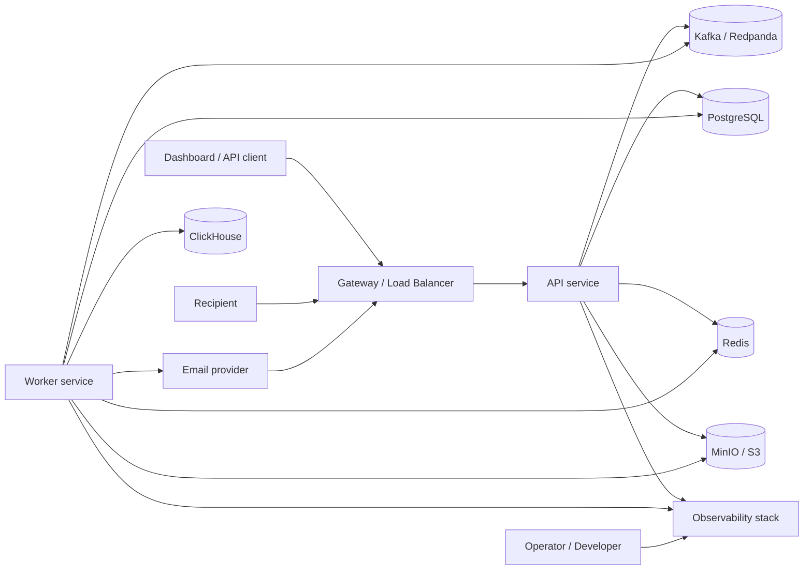
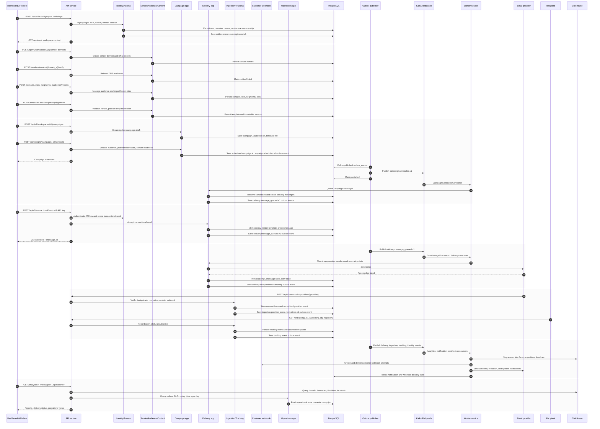

# send-flow

A modular monolith email delivery platform built in Go. send-flow provides a complete SaaS backend for building, operating, and observing email delivery flows — from sender domain authentication and audience management to campaign orchestration, transactional email, delivery analytics, and provider webhook ingestion.

## Architecture

send-flow follows a **Clean Architecture** + **Modular Monolith** + **DDD-lite** + **Event-driven** approach. Two runtimes share the same business modules:

| Runtime | Role |
|---|---|
| **API service** (`cmd/api`) | HTTP API — authentication, workspace management, CRUD operations, webhook ingress, health/readiness |
| **Worker service** (`cmd/worker`) | Background processing — Kafka consumers, outbox publisher, delivery pipeline, scheduled jobs, analytics projection |

### System Context



### Data Flow



## Tech Stack

| Component | Technology |
|---|---|
| Language | Go 1.25 |
| HTTP Framework | Chi router, Huma OpenAPI |
| Database | PostgreSQL (via pgx), ClickHouse (analytics) |
| Cache | Redis (session, rate-limit, idempotency, locks) |
| Event Bus | Kafka / Redpanda + Debezium (CDC outbox) |
| Object Storage | MinIO (dev) / AWS S3 (prod) |
| Email Sending | AWS SES (prod), SMTP / Mailpit (dev) |
| Auth | JWT, MFA/TOTP, OAuth 2.0, API keys, RBAC |
| Observability | Prometheus, Grafana, Loki, Tempo |

## Business Capabilities

| Plane | Capabilities |
|---|---|
| **Control Plane** | Auth, user/session, workspace, membership/role, API keys, sender domain verification, templates, campaigns, suppression rules |
| **Delivery Plane** | Message queue, throttle (per workspace/provider), email provider calls, retry, delivery result classification |
| **Audience Plane** | Contacts, lists, segments, import/export, send eligibility |
| **Ingestion Plane** | Provider webhook receipt, verification, deduplication, normalization |
| **Analytics Plane** | Event storage (ClickHouse), projections, reports, dashboards |
| **Operations Plane** | Outbox lag, DLQ/replay, rate-limit state, circuit breakers, health/readiness |

## Codebase Structure

```
cmd/
├── api/                    # API entry point
└── worker/                 # Worker entry point

internal/
├── apps/
│   ├── api/                # HTTP handlers, route wiring, OpenAPI registration
│   └── worker/             # Consumer wiring, job scheduling
├── modules/                # Business capabilities (domain/app/ports/infrastructure)
│   ├── identity/           # Auth, sessions, workspaces, memberships, RBAC
│   ├── access/             # API keys, permission evaluation
│   ├── audience/           # Contacts, lists, segments, import/export
│   ├── content/            # Email templates, versioning, rendering
│   ├── campaign/           # Campaign CRUD, scheduling, lifecycle
│   ├── delivery/           # Message lifecycle, provider routing, retry
│   ├── sender/             # Sender domain management, DNS verification
│   ├── suppression/        # Recipient block list
│   ├── tracking/           # Open/click tracking
│   ├── ingestion/          # Provider webhook handling
│   ├── analytics/          # Event facts, reports, projections
│   ├── webhooks/           # Outbound customer webhooks
│   ├── notification/       # Internal product notifications
│   ├── audit/              # Append-only audit log
│   └── operations/         # Outbox lag, DLQ, replay, runtime health
└── platform/               # Shared foundations
    ├── postgres/           # pgx connection pool, transactions
    ├── kafka/              # Producer/consumer abstraction
    ├── redis/              # Client wrapper
    ├── outbox/             # Transactional outbox orchestration
    ├── email/              # SES/SMTP/Mailpit senders
    ├── auth/               # JWT, middleware
    ├── config/             # Env-based configuration
    └── ...                 # clock, id, logger, validator, etc.
```

## Prerequisites

- Go 1.25+
- Docker + Docker Compose

## Quick Start

Use this flow for local development.

1. Create local env file:

```bash
cp .env.example .env
```

2. Start local infrastructure:

```bash
make dev-up
```

3. Run database migrations:

```bash
make migrate-up
```

4. Run API:

```bash
make api
```

5. Run worker in a separate terminal:

```bash
make worker
```

Optional: set `AUTO_MIGRATE=true` in `.env` to run migrations automatically on API startup.

## Common Commands

```bash
make dev-up        # Start local infra
make dev-down      # Stop and remove local infra
make dev-logs      # Tail Docker Compose logs
make api           # Run API locally
make worker        # Run worker locally
make start 2       # Run 2 API and 2 worker instances with automatic ports
make build         # Build ./bin/api and ./bin/worker
make format        # gofmt for cmd/ and internal/
make vet           # go vet ./...
make test          # go test ./...
make check         # Format, vet, test, and verify OpenAPI snapshot
make test-race     # Run race detector over internal packages
make test-integration # Run Docker-backed integration tests
make openapi-generate # Regenerate docs/api/openapi.yaml
make migrate-up    # Apply migrations
make migrate-down  # Rollback one migration step
```

## Local Service Endpoints

| Service | URL |
|---|---|
| API | http://localhost:8081 |
| API Gateway | http://localhost:8088 |
| OpenAPI JSON | http://localhost:8081/openapi.json |
| Gateway OpenAPI JSON | http://localhost:8088/openapi.json |
| Worker health/metrics | http://localhost:8082 |
| Consul | http://localhost:8500 |
| Traefik Dashboard | http://localhost:8089/dashboard/ |
| Redpanda Console | http://localhost:8080 |
| Kafka Connect | http://localhost:8083 |
| Mailpit UI | http://localhost:8025 |
| MinIO Console | http://localhost:9002 |
| Grafana | http://localhost:3001 (admin / admin) |
| Prometheus | http://localhost:9090 |

## Health Check

```bash
curl http://localhost:8081/api/readyz
curl http://localhost:8088/api/readyz
curl http://localhost:8082/api/readyz
```

Health responses include `version`, `git_sha`, and `build_time` when binaries are built through `make build`.

## Local API Gateway

`make dev-up` starts Consul and Traefik with the rest of the local infrastructure. When `SERVICE_DISCOVERY_PROVIDER=consul` is set, API processes register in Consul, and Traefik discovers them through Consul Catalog. Worker processes also register as `sendflow-worker` so Prometheus and Grafana can discover every local worker instance without hard-coded scrape ports.

```bash
make dev-up
make api
curl http://localhost:8500/v1/catalog/service/sendflow-api
curl http://localhost:8088/api/readyz
```

Use `make start N` to run N API and N worker instances. Local ports are selected randomly from available high ports and skipped if they are already used by another process or by an earlier instance in the same run. Override the range with `LOCAL_RANDOM_PORT_MIN` and `LOCAL_RANDOM_PORT_MAX` when needed. API and worker service IDs are unique in Consul. Traefik load balances the registered API instances, while Prometheus discovers both `sendflow-api` and `sendflow-worker`; Grafana dashboards expose an `instance` filter for checking each process.

## Staging Deployment

Staging should mirror production dependencies with lower capacity and isolated credentials.

1. Build release artifacts:

```bash
make check
make build VERSION=staging
```

2. Provision staging Postgres, Redis, Kafka/Redpanda, ClickHouse when analytics is enabled, object storage when import/export is enabled, and an email provider suitable for staging.
3. Apply migrations with staging `DATABASE_URL`.
4. Deploy API and worker with staging environment variables.
5. Smoke test health, auth, transactional send, provider webhook ingestion, worker lag, and analytics freshness.

## Production Deployment

Production deployment follows the launch checklist in `docs/production/launch-checklist.md`.

Before promoting a release:

- Review `docs/production/readiness-matrix.md`.
- Confirm module contracts in `docs/production/module-contracts.md` still match the release.
- Confirm route exposure in `docs/production/http-route-classification.md`.
- Run `make check` and build with an explicit version:

```bash
make build VERSION=<release-version>
```
