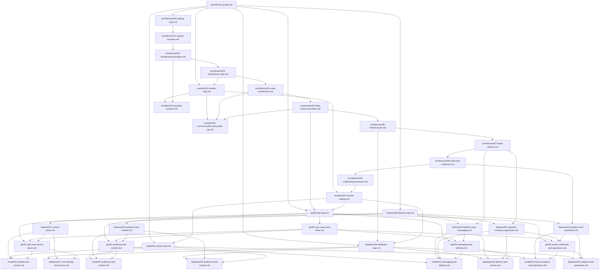

# Documentation Graph

File này là bản đồ liên kết tổng của bộ tài liệu `docs/`.

Mục tiêu:

- Chỉ ra file nào là entry point.
- Cho thấy cùng một capability được mô tả qua feature, module, API, model và database như thế nào.
- Giúp người đọc đi từ sản phẩm -> architecture -> module boundary -> contract -> schema mà không phải đoán file kế tiếp.

## Entry points

| Cần đọc | Bắt đầu từ |
|---|---|
| Tổng quan hệ thống và quyết định kiến trúc | [architecture/00-reading-map.md](architecture/00-reading-map.md) |
| Feature/capability sản phẩm | [features/00-feature-map.md](features/00-feature-map.md) |
| Bounded context và module boundary | [modules/00-module-map.md](modules/00-module-map.md) |
| Cách lên implementation note cho feature mới | [00-implementation-note.md](00-implementation-note.md) |
| Testing strategy và writing tests | [testing/00-testing-guide.md](testing/00-testing-guide.md) |
| API contract | [api/00-api-map.md](api/00-api-map.md) |
| Tích hợp API theo hành trình sản phẩm | [api/05-use-cases-and-flows.md](api/05-use-cases-and-flows.md) |
| Business model | [model/00-model-map.md](model/00-model-map.md) |
| Logical database schema | [database/00-database-map.md](database/00-database-map.md) |

## Graph tổng



## Capability trace

| Capability | Feature | Module | API | Model | Database |
|---|---|---|---|---|---|
| Control plane | [features/01-control-plane.md](features/01-control-plane.md) | [modules/03-module-catalog.md](modules/03-module-catalog.md) (`identity`, `access`, `sender`, `webhooks`, `audit`) | [api/01-auth-and-control-plane.md](api/01-auth-and-control-plane.md) | [model/01-identity-and-access.md](model/01-identity-and-access.md) | [database/01-core-identity-and-access.md](database/01-core-identity-and-access.md) |
| Audience and content | [features/02-audience-and-content.md](features/02-audience-and-content.md) | [modules/03-module-catalog.md](modules/03-module-catalog.md) (`audience`, `content`) | [api/02-audience-and-content.md](api/02-audience-and-content.md) | [model/02-audience-and-content.md](model/02-audience-and-content.md) | [database/02-audience-and-content.md](database/02-audience-and-content.md) |
| Messaging and delivery | [features/03-delivery-and-messaging.md](features/03-delivery-and-messaging.md) | [modules/03-module-catalog.md](modules/03-module-catalog.md) (`campaign`, `delivery`) | [api/03-messaging-and-delivery.md](api/03-messaging-and-delivery.md) | [model/03-messaging-and-delivery.md](model/03-messaging-and-delivery.md) | [database/03-delivery-and-events.md](database/03-delivery-and-events.md) |
| Ingestion, tracking, suppression | [features/04-ingestion-tracking-suppression.md](features/04-ingestion-tracking-suppression.md) | [modules/03-module-catalog.md](modules/03-module-catalog.md) (`ingestion`, `tracking`, `suppression`) | [api/04-events-webhooks-and-operations.md](api/04-events-webhooks-and-operations.md) | [model/03-messaging-and-delivery.md](model/03-messaging-and-delivery.md) | [database/03-delivery-and-events.md](database/03-delivery-and-events.md) |
| Analytics and operations | [features/05-analytics-and-operations.md](features/05-analytics-and-operations.md) | [modules/03-module-catalog.md](modules/03-module-catalog.md) (`analytics`, `operations`) | [api/04-events-webhooks-and-operations.md](api/04-events-webhooks-and-operations.md) | [model/04-events-analytics-and-operations.md](model/04-events-analytics-and-operations.md) | [database/04-analytics-and-operations.md](database/04-analytics-and-operations.md) |

## Recommended reading paths

### Implement một feature mới

```text
features/<capability>.md
  -> modules/03-module-catalog.md
  -> api/<matching-api>.md
  -> model/<matching-model>.md
  -> database/<matching-database>.md
  -> architecture/04-code-architecture.md
  -> architecture/09-engineering-practices.md
```

### Review boundary hoặc tách service

```text
architecture/02-architecture-principles.md
  -> architecture/03-architecture-style.md
  -> modules/01-bounded-contexts.md
  -> modules/02-communication-and-public-api.md
  -> modules/03-module-catalog.md
```

### Thiết kế event/async flow

```text
architecture/05-data-events-and-flows.md
  -> modules/02-communication-and-public-api.md
  -> api/00-api-map.md
  -> model/04-events-analytics-and-operations.md
  -> database/03-delivery-and-events.md
  -> database/04-analytics-and-operations.md
```

### Tích hợp API theo hành trình sản phẩm

```text
api/05-use-cases-and-flows.md
  -> api/00-api-map.md
  -> api/01-auth-and-control-plane.md
  -> api/02-audience-and-content.md
  -> api/03-messaging-and-delivery.md
  -> api/04-events-webhooks-and-operations.md
```
