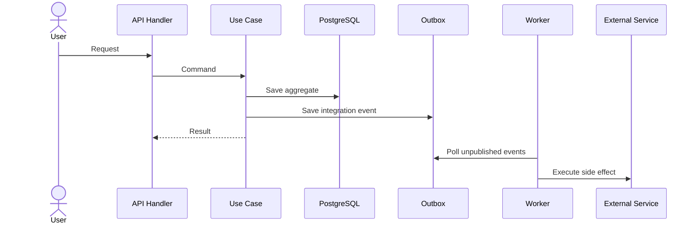
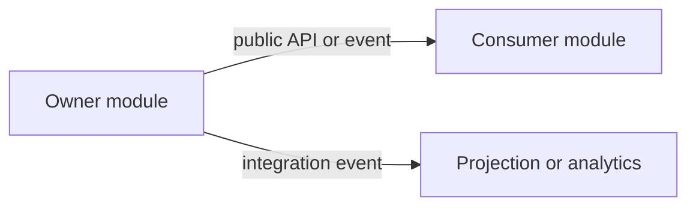

# Implementation Note

File này là playbook để triển khai một feature mới trong `send-flow`. Mục tiêu là giúp team đi từ yêu cầu -> đọc đúng docs -> chốt boundary/architecture -> lên plan -> vẽ diagram -> chờ confirm -> code -> verify -> test mà không bỏ sót decision quan trọng.

## Khi nào dùng

Dùng file này khi:

- Bắt đầu implement feature mới.
- Refactor một flow nghiệp vụ có thay đổi behavior.
- Thêm API, event, schema hoặc background worker mới.
- Cần viết implementation plan trước khi code.

Không dùng file này như spec sản phẩm cuối cùng. Đây là note để team triển khai đúng kiến trúc và đúng quy trình.

## Entry points cần đọc trước

Đọc theo thứ tự này để có shared context:

```text
docs/00-doc-graph.md
  -> docs/architecture/00-reading-map.md
  -> docs/features/00-feature-map.md
  -> docs/modules/00-module-map.md
  -> docs/architecture/04-code-architecture.md
  -> docs/architecture/09-engineering-practices.md
```

## Cách chọn docs theo loại feature

| Nếu feature thuộc nhóm | Đọc product docs | Đọc contract docs | Đọc model/docs dữ liệu |
|---|---|---|---|
| Control plane | `../features/01-control-plane.md` | `../api/01-auth-and-control-plane.md` | `../model/01-identity-and-access.md`, `../database/01-core-identity-and-access.md` |
| Audience and content | `../features/02-audience-and-content.md` | `../api/02-audience-and-content.md` | `../model/02-audience-and-content.md`, `../database/02-audience-and-content.md` |
| Delivery and messaging | `../features/03-delivery-and-messaging.md` | `../api/03-messaging-and-delivery.md` | `../model/03-messaging-and-delivery.md`, `../database/03-delivery-and-events.md` |
| Ingestion, tracking, suppression | `../features/04-ingestion-tracking-suppression.md` | `../api/04-events-webhooks-and-operations.md` | `../model/03-messaging-and-delivery.md`, `../database/03-delivery-and-events.md` |
| Analytics and operations | `../features/05-analytics-and-operations.md` | `../api/04-events-webhooks-and-operations.md` | `../model/04-events-analytics-and-operations.md`, `../database/04-analytics-and-operations.md` |

Đọc thêm các file nền khi feature có tính chất tương ứng:

- Có module boundary mới hoặc gọi chéo module: `../modules/01-bounded-contexts.md`, `../modules/02-communication-and-public-api.md`, `../modules/03-module-catalog.md`
- Có async flow, event, webhook, retry, outbox: `../architecture/05-data-events-and-flows.md`
- Có hạ tầng mới hoặc phụ thuộc runtime: `../architecture/06-infrastructure.md`
- Có email delivery concern: `../architecture/07-email-delivery.md`
- Có scale/rate-limit/retry/backpressure: `../architecture/08-scale-and-resilience.md`

## Kiến trúc mặc định phải bám theo

Trước khi code, assume feature mới phải bám theo baseline sau, trừ khi có ADR mới:

- `Clean Architecture`: runtime chỉ orchestration; business rule nằm trong `modules/<module>/app` và `domain`
- `DDD nhẹ`: chỉ model hóa mạnh ở chỗ có invariant, state transition, value object, domain event
- `Modular Monolith`: giữ boundary theo module; không import sâu infrastructure của module khác
- `Event-driven`: cross-module propagation và side effect async đi qua outbox/event contract/idempotent consumer
- `CQRS when it matters`: nếu feature có read-heavy hoặc write-heavy path rõ ràng thì phải tách read/write contract sớm; app layer tách command/query handler, infra tách read/write repository, runtime wiring đi đúng pool/adapter tương ứng
- `Local infra parity`: nếu feature cần read replica, local `ops/deployments/local` phải phản ánh được read/write topology, có env riêng cho read URL và health signal đọc được cả hai phía
- `Do not assume from design`: trước khi kết luận một feature đã theo kiến trúc mong muốn, phải đọc code hiện tại và xác nhận bằng repo truth, không dựa vào tên folder, comment, hoặc expectation.
- `No partial CQRS`: nếu tách command/query thì không dừng ở handler; phải đi đến ports, deps, infra repository, runtime wiring, health/readiness, config, local deployment, và tests tương ứng.

Tóm tắt rule placement:

| Concern | Nơi đặt |
|---|---|
| HTTP handler, DTO, auth middleware, response mapping | `internal/apps/api/...` |
| Worker consumer, scheduler, retry loop registration | `internal/apps/worker/...` |
| Use case orchestration | `internal/modules/<module>/app/<usecase>` |
| Invariant, aggregate, value object, domain event | `internal/modules/<module>/domain` |
| Public contract cho module khác consume | `internal/modules/<module>/contracts` |
| Repository/adapter kỹ thuật của module | `internal/modules/<module>/infrastructure` |
| Technical primitive dùng chung | `internal/platform/<capability>` |

## Quy trình triển khai chuẩn

### 1. Chốt phạm vi feature

Trả lời ngắn gọn các câu hỏi:

- Actor nào dùng feature này?
- Thành công của feature được đo bằng behavior nào?
- Flow này là synchronous, asynchronous hay hybrid?
- Module owner chính là module nào?
- Module nào chỉ là consumer hoặc projection?
- Có thay đổi API, event, schema, queue, webhook hay analytics không?

Output mong đợi:

```text
Feature:
Primary module owner:
Affected modules:
Actors:
In scope:
Out of scope:
Success criteria:
```

### 2. Lập reading list cho feature

Từ capability trace, liệt kê cụ thể các file phải đọc để hiểu feature. Ít nhất nên có:

- 1 file `features/*`
- 1 file `api/*`
- 1 file `model/*`
- 1 file `database/*`
- `../architecture/04-code-architecture.md`
- `../architecture/09-engineering-practices.md`

Nếu feature có async/event, bắt buộc đọc thêm:

- `../architecture/05-data-events-and-flows.md`
- `../modules/02-communication-and-public-api.md`

Output mong đợi:

```text
Required docs:
1. ...
2. ...

Key assumptions extracted from docs:
- ...
- ...
```

### 3. Chốt implementation strategy

Trước khi viết code, ghi rõ:

- Feature thuộc module nào.
- Aggregate hoặc entity chính là gì.
- Command/query/use case mới nào cần thêm.
- API endpoint, event contract, webhook hoặc projection nào bị ảnh hưởng.
- Schema/table owner là module nào.
- Chỗ nào cần strong consistency trong transaction.
- Chỗ nào eventual consistency qua event/outbox là đủ.

Checklist decision:

- Có cần thêm module mới không? Nếu có, giải thích vì sao chưa đặt vào module cũ.
- Có đang định viết SQL trực tiếp từ handler/worker không? Nếu có, dừng và đưa logic về use case/module.
- Có cross-module write không? Nếu có, đổi sang event hoặc public module API.
- Có side effect async sau commit không? Nếu có, dùng transactional outbox.
- Có retry không? Nếu có, idempotency key là gì?
- Nếu feature có read replica hoặc read-heavy query path, đã tách `ReadRepository`/`WriteRepository`, config `DATABASE_READ_URL`, và health check cho read pool chưa?
- Nếu feature chạm local dev infra, đã xác nhận image tag tồn tại, service healthcheck hợp lý, port mapping không xung đột, và app có thể `dev-up` sạch chưa?
- Nếu feature thêm test integration, đã chốt command riêng, tag riêng, và dependency đã được thêm vào `go.mod/go.sum` chưa?
- Nếu feature cần nhào lại kiến trúc hiện có, đã kiểm tra code paths hiện tại để tránh đoán sai boundary chưa?

### 4. Lên plan trước khi code

Plan nên đi theo dependency thật, không đi theo file order. Template:

```text
Phase 1. Contract and boundary
- Chốt command/query, DTO, event, error model
- Chốt owner module và transaction boundary

Phase 2. Domain and app
- Thêm/điều chỉnh aggregate, value object, domain service
- Implement use case handler

Phase 3. Infrastructure
- Repository, outbox, consumer, external adapter, migration

Phase 4. Runtime wiring
- API route/handler hoặc worker registration

Phase 5. Verification
- Unit/integration/e2e
- Manual verification checklist
- Docs update
```

Nếu feature lớn, tách thành rollout plan:

- Phase A: skeleton và contract
- Phase B: happy path
- Phase C: async side effect
- Phase D: analytics/ops hardening

### 5. Vẽ diagram và chờ confirm

Trước khi code flow lớn hoặc flow có async boundary, phải vẽ diagram và chờ xác nhận.

Nên vẽ tối thiểu:

- Sequence diagram cho request -> use case -> DB/outbox -> worker -> downstream
- Module interaction diagram nếu có hơn 1 module tham gia
- Data/state transition diagram nếu aggregate có lifecycle phức tạp

Template sequence diagram:



Template module interaction diagram:



Chỉ bắt đầu code sau khi đã chốt:

- Boundary đúng
- Event/API contract đúng
- Chỗ sync vs async đúng
- Không vi phạm ownership của schema/module

### 6. Implement theo code convention

Convention tối thiểu:

- Tên package/folder lowercase, tránh `utils`, `helpers`, `common`
- Use case package dùng verb hoặc verb+noun như `signup`, `createcampaign`, `schedulecampaign`
- Chỉ kéo logic lên `platform` khi có 2-3 caller thật sự dùng chung
- Không đặt business rule trong handler, consumer, repository, migration
- Không để domain biết HTTP, JSON, SQL, Kafka topic, Redis key
- Không import `infrastructure` của module khác

Nếu phải chia file:

```text
internal/modules/<module>/app/<usecase>/
  command.go
  handler.go
  result.go
```

Với API:

```text
internal/apps/api/modules/<module>/
  dto.go
  mapper.go
  handler.go
  routes.go
```

Với worker:

```text
internal/apps/worker/modules/<module>/
  dto.go
  mapper.go
  consumer.go
```

### 7. Verify như thế nào

Verify theo nhiều lớp, không chỉ "chạy được".

#### Business verification

- Happy path đúng với success criteria.
- Domain invariant không bị phá.
- Error path map đúng ra API error hoặc retry/DLQ behavior.
- Idempotent khi request/event bị retry.
- Event chỉ publish sau khi transaction commit.

#### Data verification

- Schema change đúng owner module.
- Migration forward được trên database sạch và database đã có dữ liệu.
- Index/supporting constraint đủ cho query path mới.
- Projection/read model eventual consistency được chấp nhận ở chỗ nào đã ghi rõ.

#### Runtime verification

- API route/worker được wire đúng.
- Timeout, retry, backoff, rate-limit hoặc queue behavior hợp lý.
- Logging, metrics, trace có field đủ để debug flow mới.
- Nếu có read replica, verify query path thực sự đi qua read pool và command path đi qua write pool.
- Nếu local deployment có service mới hoặc image mới, phải smoke test `make dev-up` hoặc lệnh tương đương trước khi coi là xong.

#### Manual verification checklist

```text
[ ] Happy path
[ ] Validation error
[ ] Duplicate/retry path
[ ] Permission/auth boundary
[ ] Async consumer path
[ ] Replay/idempotency path
[ ] Observability signal xuất hiện
```

Rule chi tiết cho verification theo từng layer và từng feature shape nằm ở `testing/00-testing-guide.md`.

## Test standard

Tuân theo test pyramid trong `testing/00-testing-guide.md`:

```text
unit          ~80%
integration  ~15%
e2e           ~5%
```

Áp dụng nhanh:

- `Unit`: domain invariant, state transition, value object validation, app orchestration.
- `Integration`: repository, transaction manager, outbox, adapter boundary có rủi ro.
- `E2E`: flow ít nhưng quan trọng như API -> DB -> outbox -> consumer hoặc webhook -> normalize -> state change.
- Khi thêm integration test mới, phải có command riêng để chạy độc lập với unit suite, và thêm dependency vào `go.mod/go.sum` trước khi test.
- Integration test phải dùng API của thư viện đúng với version trong `go.mod`; nếu library đổi API, test phải fail sớm thay vì bị silently downgraded.
- Nếu integration test đụng container/image, phải pin hoặc validate tag cụ thể trước khi merge.

Rule chi tiết về naming, placement, fixture/fake, local/CI workflow và cách chọn test theo feature shape nằm ở `testing/00-testing-guide.md`.

## Definition of done cho một feature

Feature chỉ được coi là xong khi:

- Có implementation note hoặc plan ngắn gắn với docs đã đọc
- Boundary/module owner được chốt rõ
- Diagram đã được review nếu flow đủ phức tạp
- Code placement đúng kiến trúc
- Test đủ theo rủi ro
- Manual verification pass
- API/event/schema/docs liên quan đã cập nhật
- Observability tối thiểu có mặt
- Nếu feature chạm infra local, `make dev-up` phải pass trên môi trường dev sạch hoặc có ghi chú rõ điều kiện tiên quyết.
- Nếu feature chạm infra local, `make dev-up` phải pass trên môi trường dev sạch hoặc có ghi chú rõ điều kiện tiên quyết.
- Nếu feature thêm integration test, phải có lệnh chạy riêng, và test đó phải pass ít nhất một lần trên môi trường có Docker.

## Mẫu note để dùng ngay

```text
# <feature-name>

## Summary
- Mục tiêu:
- Actor:
- Success criteria:

## Reading list
1. ...
2. ...

## Scope
- In scope:
- Out of scope:

## Architecture decisions
- Owner module:
- Affected modules:
- Sync boundary:
- Async boundary:
- API change:
- Event change:
- Schema change:

## Plan
1. ...
2. ...
3. ...

## Diagram to confirm
- Sequence:
- Module interaction:
- State transition:

## Verification
- Unit test:
- Integration test:
- E2E:
- Manual checklist:
```
