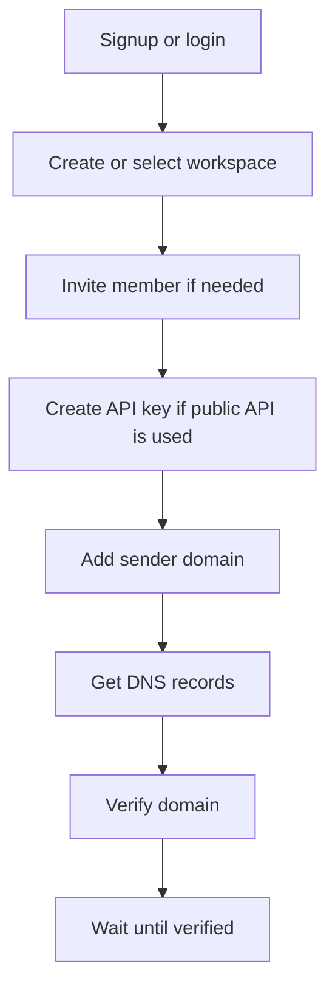
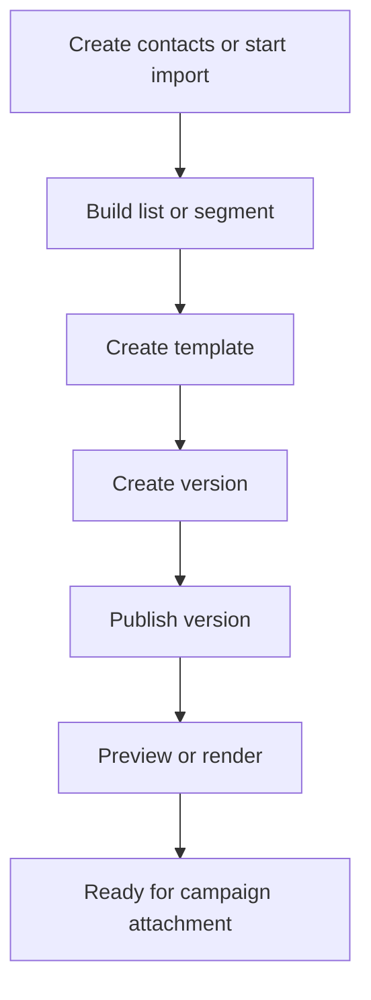
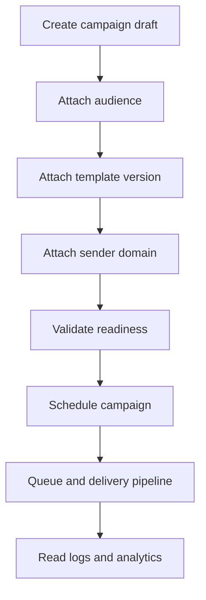
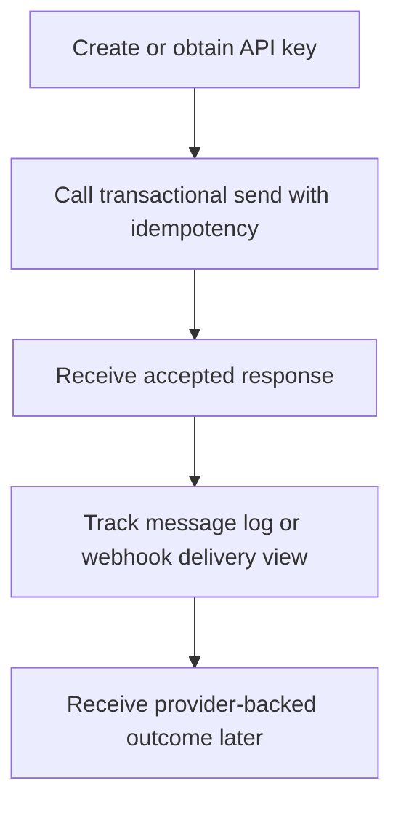
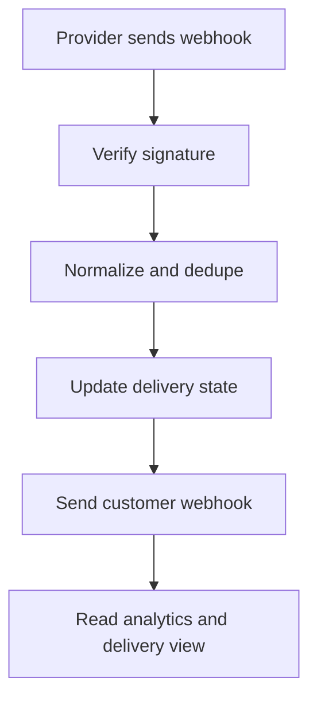
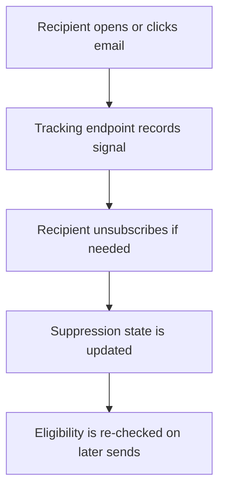

# API Use Cases And Flows

File này bổ sung góc nhìn **dùng API theo hành trình** cho `send-flow`.

Trong khi các file `01` đến `04` trả lời câu hỏi "API nào tồn tại và contract của từng resource là gì?", file này trả lời câu hỏi "cần phối hợp những API nào, theo thứ tự nào, để hoàn thành một use case sản phẩm?".

## Cách đọc

- Dùng file này khi cần nhìn nhanh end-to-end flow trước khi đi sâu vào request/response của từng endpoint.
- Mỗi use case chỉ nhắc API tham gia, boundary đồng bộ/bất đồng bộ và lỗi/trạng thái hay gặp.
- Khi cần contract chi tiết của từng API, đi tiếp sang file resource tương ứng trong `docs/api/`.

## Quy ước trong flow

- `Actor`: người hoặc hệ thống khởi đầu hành trình.
- `API surface`: nhóm API chính tham gia flow.
- `Sync step`: bước caller nhận response trực tiếp trong request path.
- `Async step`: bước diễn ra sau khi request đã được chấp nhận.
- `Eventual consistency point`: chỗ dữ liệu đọc có thể trễ hơn state nghiệp vụ gốc.

## Use case index

| Nhu cầu | Đọc mục |
|---|---|
| Onboard workspace và chuẩn bị gửi | [Use case 1](#use-case-1-onboard-workspace-va-chuan-bi-gui) |
| Chuẩn bị audience và content cho campaign | [Use case 2](#use-case-2-chuan-bi-audience-va-content-cho-campaign) |
| Tạo và schedule campaign marketing | [Use case 3](#use-case-3-tao-va-schedule-campaign-marketing) |
| Gửi transactional email qua public API | [Use case 4](#use-case-4-gui-transactional-email-qua-public-api) |
| Theo dõi hậu gửi và đồng bộ downstream | [Use case 5](#use-case-5-theo-doi-hau-gui-va-dong-bo-downstream) |
| Recipient click, open, unsubscribe và suppression | [Use case 6](#use-case-6-recipient-click-open-unsubscribe-va-suppression) |

## Use case 1: Onboard workspace va chuan bi gui

### Mục tiêu

Thiết lập workspace đủ điều kiện để gửi email an toàn qua dashboard hoặc public API.

### Actor chính

- Workspace admin
- Dashboard user

### Khi nào dùng

- Tenant mới vào hệ thống.
- Tenant cần chuẩn bị sender domain và credential trước khi tích hợp gửi email.

### API tham gia

- [Auth và session](01-auth-and-control-plane.md)
- [Workspaces, memberships, invitations](01-auth-and-control-plane.md)
- [API keys](01-auth-and-control-plane.md)
- [Sender domains](01-auth-and-control-plane.md)

### Luồng chính

1. Dashboard user gọi `signup` hoặc `login`, sau đó lấy `me` để biết identity hiện tại, memberships và quyền hiệu lực.
2. Nếu chưa có tenant boundary phù hợp, user tạo workspace mới hoặc chọn workspace hiện có.
3. Workspace admin mời thêm member và gán role nếu flow vận hành có nhiều người cùng quản trị.
4. Nếu tenant sẽ gọi public API, workspace admin tạo API key theo scope phù hợp.
5. User thêm sender domain để hệ thống sinh DNS records cần cấu hình.
6. Tenant cấu hình DNS ở nhà cung cấp domain của mình.
7. Dashboard gọi verify/check để hệ thống kiểm tra trạng thái xác thực domain.
8. Chỉ khi sender domain đạt trạng thái verified hoặc authenticated thì tenant mới nên đưa traffic production vào flow gửi.

### Điểm bất đồng bộ / eventual consistency

- DNS verification thường không hoàn tất ngay trong request tạo sender domain.
- Dashboard có thể phải poll lại sender domain status cho đến khi `verified`.

### Trạng thái hoặc lỗi thường gặp

- `auth.invalid_credentials`
- `identity.permission_denied`
- `api_key.scope_denied`
- `sender.domain_not_verified`
- `403` khi actor không thuộc `workspace_id` đang được yêu cầu hoặc không có quyền phù hợp

### Đọc sâu thêm

- [Auth And Control Plane API](01-auth-and-control-plane.md)
- [Feature control plane](../features/01-control-plane.md)
- [Email delivery domain verification workflow](../architecture/07-email-delivery.md)

## Use case 2: Chuan bi audience va content cho campaign

### Mục tiêu

Chuẩn bị dữ liệu người nhận và nội dung tái sử dụng được trước khi tạo campaign.

### Actor chính

- Marketer
- Content editor

### Khi nào dùng

- Tenant muốn chạy campaign marketing từ dashboard.
- Team cần tách bước chuẩn bị audience và content khỏi bước schedule campaign.

### API tham gia

- [Contacts](02-audience-and-content.md)
- [Lists và segments](02-audience-and-content.md)
- [Import/export audience](02-audience-and-content.md)
- [Templates](02-audience-and-content.md)
- [Render và preview](02-audience-and-content.md)

### Luồng chính

1. Team tạo contact trực tiếp hoặc trigger import audience để nạp danh sách người nhận.
2. Marketer tạo list hoặc segment để gom audience theo rule nghiệp vụ.
3. Content editor tạo template và các version của template.
4. Team publish template version dùng cho campaign hoặc flow gửi khác.
5. Trước khi attach vào campaign, user gọi preview/render để kiểm tra nội dung và dữ liệu render.

### Điểm bất đồng bộ / eventual consistency

- Import/export audience có thể là async job, không hoàn tất ngay trong request trigger.
- Segment materialization hoặc projection contact counts có thể trễ.
- Preview thành công không đồng nghĩa audience đã sẵn sàng nếu import hoặc segment chưa hoàn tất.

### Trạng thái hoặc lỗi thường gặp

- `template.render_payload_invalid`
- `analytics.projection_not_ready`
- `404` khi list, segment hoặc template không còn trong workspace hiện tại
- `422` khi dữ liệu import hợp lệ về shape nhưng vi phạm rule nghiệp vụ

### Đọc sâu thêm

- [Audience And Content API](02-audience-and-content.md)
- [Feature audience and content](../features/02-audience-and-content.md)

## Use case 3: Tao va schedule campaign marketing

### Mục tiêu

Tạo campaign marketing, kiểm tra readiness của các dependency và lên lịch gửi.

### Actor chính

- Dashboard user

### Khi nào dùng

- Tenant cần gửi chiến dịch có audience, template và sender đã chuẩn bị sẵn.

### API tham gia

- [Campaigns](03-messaging-and-delivery.md)
- [Message logs](03-messaging-and-delivery.md)
- [Analytics và dashboard](04-events-webhooks-and-operations.md)

### Luồng chính

1. Dashboard user tạo campaign draft.
2. User gắn audience reference, template/version và sender domain vào campaign.
3. Hệ thống validate readiness của audience, content và sender trước khi cho schedule.
4. User gọi endpoint schedule để tạo send intent cho campaign.
5. Sau khi request được chấp nhận, user theo dõi tiến trình qua campaign summary, message logs và analytics dashboard.

### Điểm bất đồng bộ / eventual consistency

- `schedule` chỉ là sync acceptance của một intent, không phải bảo đảm email đã được gửi.
- Queueing, delivery worker, provider event ingestion và projection update đều diễn ra async sau đó.
- Analytics và log summary có thể cập nhật trễ hơn workflow state gốc.

### Trạng thái hoặc lỗi thường gặp

- `campaign.invalid_state_transition`
- `campaign.audience_not_ready`
- `sender.domain_not_verified`
- `template.render_payload_invalid`
- `422` khi campaign chưa đủ dependency để schedule

### Đọc sâu thêm

- [Messaging And Delivery API](03-messaging-and-delivery.md)
- [Events Webhooks And Operations API](04-events-webhooks-and-operations.md)
- [Feature delivery and messaging](../features/03-delivery-and-messaging.md)

## Use case 4: Gui transactional email qua public API

### Mục tiêu

Cho tenant developer gửi transactional email với độ trễ thấp ở request path nhưng vẫn an toàn với retry và delivery pipeline phía sau.

### Actor chính

- Public API client
- Tenant developer

### Khi nào dùng

- Ứng dụng của tenant cần gửi email xác nhận, OTP, receipt hoặc notification theo sự kiện nghiệp vụ riêng.

### API tham gia

- [API keys](01-auth-and-control-plane.md)
- [Transactional email](03-messaging-and-delivery.md)
- [Message logs](03-messaging-and-delivery.md)
- [Customer webhook delivery view](04-events-webhooks-and-operations.md)

### Luồng chính

1. Workspace admin tạo API key và cấp scope phù hợp cho public API client.
2. Client gọi transactional send, kèm idempotency cho các request có khả năng bị retry.
3. API trả response `accepted` nhanh khi intent hợp lệ và đã được ghi nhận an toàn.
4. Client hoặc dashboard truy vết message qua message logs hoặc customer webhook delivery view.
5. Outcome delivery cuối cùng đến sau, khi provider send execution và event ingestion hoàn tất.

### Điểm bất đồng bộ / eventual consistency

- Request path chỉ xác nhận hệ thống đã chấp nhận send intent.
- Delivery thực tế, retry, bounce hoặc complaint xảy ra ngoài HTTP request ban đầu.
- Message log và downstream webhook view có thể cập nhật sau một khoảng trễ ngắn.

### Trạng thái hoặc lỗi thường gặp

- `delivery.idempotency_key_conflict`
- `api_key.scope_denied`
- `delivery.recipient_suppressed`
- `sender.domain_not_verified`
- `429` khi request bị rate limit hoặc throttling

### Đọc sâu thêm

- [Messaging And Delivery API](03-messaging-and-delivery.md)
- [Auth And Control Plane API](01-auth-and-control-plane.md)
- [Feature delivery and messaging](../features/03-delivery-and-messaging.md)

## Use case 5: Theo doi hau gui va dong bo downstream

### Mục tiêu

Theo dõi outcome delivery sau khi provider xử lý message và đồng bộ event ra downstream system của tenant.

### Actor chính

- Dashboard user
- Downstream system của tenant

### Khi nào dùng

- Cần xem message đã delivered, bounced, complained hay chưa.
- Cần đẩy event delivery sang CRM, product backend hoặc data pipeline của tenant.

### API tham gia

- [Provider webhook ingress](04-events-webhooks-and-operations.md)
- [Customer webhook delivery view](04-events-webhooks-and-operations.md)
- [Analytics và dashboard](04-events-webhooks-and-operations.md)

### Luồng chính

1. Provider gọi webhook ingress của `send-flow` với event hậu gửi.
2. Hệ thống verify signature, normalize payload và dedupe event nếu cần.
3. Delivery state được cập nhật theo normalized event.
4. `send-flow` phát customer webhook ra downstream endpoint mà tenant đã đăng ký.
5. Dashboard user đọc analytics hoặc delivery view để xem aggregate và xu hướng vận hành.

### Điểm bất đồng bộ / eventual consistency

- Source of truth cho outcome chi tiết đến từ provider event pipeline, không phải từ response của lệnh send ban đầu.
- Dashboard aggregate, analytics projection và webhook delivery history đều có thể trễ hơn delivery state nội bộ.

### Trạng thái hoặc lỗi thường gặp

- `webhook.invalid_signature`
- `webhook.payload_invalid`
- `webhook.ingest_temporarily_unavailable`
- `analytics.projection_not_ready`
- `503` tạm thời ở downstream webhook delivery path hoặc analytics read model

### Đọc sâu thêm

- [Events Webhooks And Operations API](04-events-webhooks-and-operations.md)
- [Feature ingestion, tracking, suppression](../features/04-ingestion-tracking-suppression.md)
- [Feature analytics and operations](../features/05-analytics-and-operations.md)

## Use case 6: Recipient click, open, unsubscribe va suppression

### Mục tiêu

Ghi nhận tương tác của recipient và phản ánh các tín hiệu đó vào eligibility cho những lần gửi tiếp theo.

### Actor chính

- Recipient

### Khi nào dùng

- Recipient mở email, click link hoặc muốn unsubscribe.
- Team cần hiểu vì sao một địa chỉ về sau không còn eligible cho marketing send.

### API tham gia

- [Tracking và unsubscribe endpoint](04-events-webhooks-and-operations.md)
- [Suppression list ở góc nhìn audience](02-audience-and-content.md)

### Luồng chính

1. Recipient mở email hoặc tải tracking pixel để phát sinh open signal.
2. Recipient click link trong email, tracking endpoint ghi event rồi redirect sang URL đích.
3. Nếu recipient unsubscribe, endpoint unsubscribe ghi suppression idempotent.
4. Các flow campaign hoặc transactional send sau đó re-check eligibility trước khi enqueue hoặc send.
5. Dashboard hoặc audience view có thể đọc suppression state ở góc nhìn người vận hành.

### Điểm bất đồng bộ / eventual consistency

- Click/open event thường được ghi nhanh ở recipient-facing endpoint, còn projection analytics có thể cập nhật sau.
- Unsubscribe có thể phản ánh tức thì ở suppression source of truth nhưng list/audience projection cập nhật trễ hơn.

### Trạng thái hoặc lỗi thường gặp

- `tracking.invalid_tracking_id`
- `404` hoặc fallback page khi token click không còn hợp lệ
- `delivery.recipient_suppressed`
- `422` khi một send intent bị từ chối vì recipient không còn eligible

### Đọc sâu thêm

- [Events Webhooks And Operations API](04-events-webhooks-and-operations.md)
- [Audience And Content API](02-audience-and-content.md)
- [Feature ingestion, tracking, suppression](../features/04-ingestion-tracking-suppression.md)
