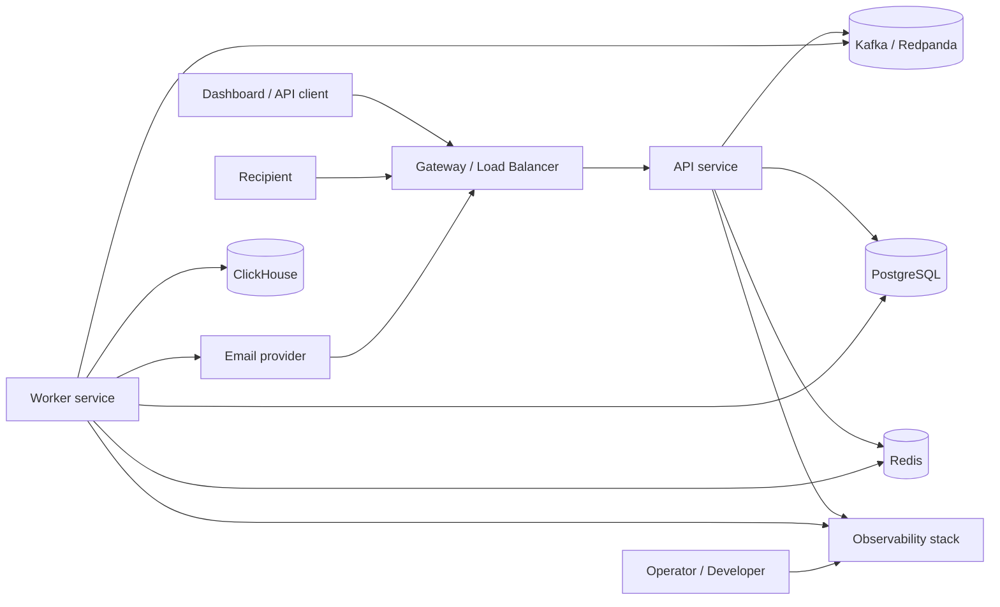
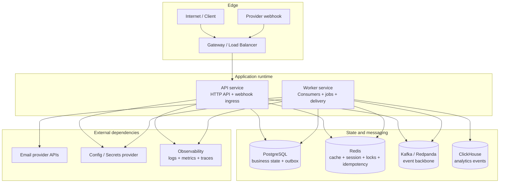
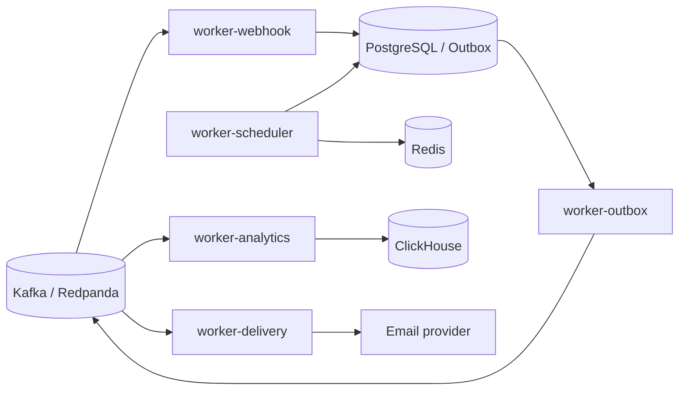
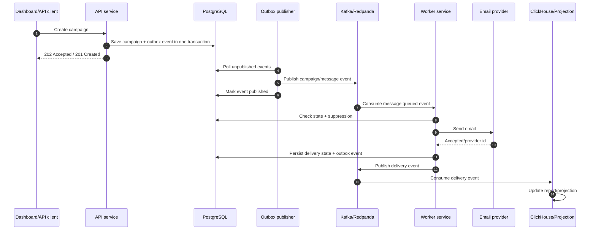

# System Overview

`send-flow` backend đi theo hướng **Go + Clean Architecture + Modular Monolith + DDD nhẹ + Event-driven**. Hệ thống có hai runtime chính là API service và Worker service, nhưng business capability được giữ chung trong `internal/modules`.

## Liên kết liên quan

| Góc nhìn | File |
|---|---|
| Docs graph | `../00-doc-graph.md` |
| Architecture principles | `02-architecture-principles.md` |
| Feature map | `../features/00-feature-map.md` |
| Module map | `../modules/00-module-map.md` |
| API map | `../api/00-api-map.md` |
| Database map | `../database/00-database-map.md` |

## Purpose

`send-flow` là SaaS backend để xây dựng, vận hành và quan sát email delivery flow theo workspace. User có thể đăng ký tài khoản, tạo nhiều workspace, mời user khác vào workspace, và có role/permission khác nhau trong từng workspace. Phần lớn dữ liệu sản phẩm như sender/domain, contacts, templates, campaigns, transactional email, logs và analytics đều thuộc về một workspace.

Nhìn từ bên ngoài, hệ thống có năm nhóm trách nhiệm chính:

| Nhóm | Trách nhiệm |
|---|---|
| Control plane | Auth, user/session, workspace, membership/role, API key, webhook config, sender/domain, template, campaign, suppression rule |
| Delivery plane | Queue message, throttle theo workspace/provider, gọi email provider, retry, classify delivery result |
| Audience plane | Contacts, lists, segments, import/export và send eligibility |
| Ingestion plane | Nhận provider webhook, normalize event, dedupe, cập nhật delivery/suppression/tracking/logs |
| Analytics plane | Lưu event volume lớn, build projection/report, phục vụ dashboard |
| Operations plane | Observability, DLQ/replay, feature flags, health/readiness, background jobs |

System không cố biến mọi thứ thành synchronous request/response. Những thao tác cần phản hồi ngay cho user đi qua API runtime; các side effect dài, dễ retry hoặc volume lớn đi qua Worker runtime và event backbone.

## External actors

| Actor | Tương tác với hệ thống |
|---|---|
| Dashboard/API client | Gọi API để login, chọn workspace, cấu hình domain, quản lý audience/template/campaign/transactional email, xem report/log |
| Public API client | Gửi transactional email, quản lý resource trong workspace qua API key |
| Recipient | Mở email, click link tracking, unsubscribe hoặc complaint qua provider |
| Email provider | Nhận send request từ delivery worker và gửi webhook event ngược về hệ thống |
| Operator/developer | Theo dõi metric/log/trace, xử lý DLQ, replay event, rollout feature flag |

## System context



```text
Dashboard/API client
  -> API runtime
     -> business modules
     -> PostgreSQL/Redis
     -> transactional outbox

Outbox publisher / Worker runtime
  -> Kafka
  -> delivery, analytics, suppression, tracking consumers
  -> email provider / ClickHouse / projections

Email provider
  -> webhook endpoint
  -> normalize + dedupe
  -> Kafka events
  -> delivery/suppression/tracking/analytics updates

Observability stack
  <- logs, metrics, traces from API and Worker
```

## Runtime and infrastructure overview

Đây là component view ở mức deploy/runtime. Nó trả lời hệ thống có service nào, service đó làm gì, và phụ thuộc vào hạ tầng nào.



```text
Internet / Client
  -> Gateway / Load Balancer
     -> API service
        -> PostgreSQL
        -> Redis
        -> Kafka / Outbox
        -> Observability stack

Provider webhook
  -> Gateway / Load Balancer
     -> API service webhook endpoint
        -> PostgreSQL raw/dedupe store
        -> Kafka normalized event

Worker service
  -> Kafka consumer
  -> Outbox publisher
  -> Scheduled jobs
  -> PostgreSQL
  -> Redis
  -> ClickHouse
  -> Email provider APIs
  -> Observability stack

Operator
  -> Grafana / logs / traces / metrics
```

| Component | Vai trò chính | State/Dependency |
|---|---|---|
| Gateway / Load Balancer | TLS termination, routing, rate limit thô, forward request vào API | Không giữ business state |
| API service | HTTP API, auth/session, command/query cho dashboard, webhook ingress, health/readiness | PostgreSQL, Redis, outbox/Kafka, observability |
| Worker service | Kafka consumers, outbox publisher, scheduled jobs, async side effects, delivery pipeline | PostgreSQL, Redis, Kafka, ClickHouse, email providers |
| PostgreSQL | Source of truth cho business state và transactional outbox | Persistent |
| Redis | Ephemeral state: cache, session, rate limit, idempotency TTL, short lock | Ephemeral, phải có TTL |
| Kafka/Redpanda | Event backbone giữa API/Worker/module consumers | Durable event log theo retention |
| ClickHouse | Analytics/event store cho email delivery/reporting volume lớn | Persistent analytics |
| Email providers | External delivery APIs và webhook source | External dependency |
| Observability stack | Logs, metrics, traces, dashboard, alerting | Loki/Grafana/Tempo/Mimir hoặc equivalent |
| Config/Secrets | Runtime config và secret provider theo environment | Env/secret manager, không commit secret thật |

## Deployment topology

Giai đoạn đầu có thể deploy tối giản:

```text
api        # stateless, scale horizontal theo HTTP traffic
worker     # stateless process nhưng chạy consumer/job; scale theo queue lag
postgres   # managed hoặc container local
redis      # managed hoặc container local
redpanda   # Kafka-compatible local/dev, Kafka/managed Kafka ở prod
grafana stack
```

Khi workload tăng, Worker service có thể tách thành nhiều process chuyên trách mà vẫn dùng chung module/use case:



```text
worker-outbox
worker-delivery
worker-webhook
worker-analytics
worker-scheduler
```

Không nên tách sớm nếu chỉ để “trông giống microservice”. Tách khi có lý do vận hành rõ: scale khác nhau, failure isolation, queue lag riêng, resource profile khác, hoặc deployment cadence khác.

## Core capabilities

| Capability | Mục đích | Runtime chính |
|---|---|---|
| Identity | User, auth, session, workspace, membership, role, binary permissions/RBAC | API |
| API access | Workspace-scoped API keys, token scope, public API authentication, key rotation | API |
| Sender authentication | Verify domain/DNS/provider credential | API + Worker |
| Audience | Contacts, lists, segments, imports/exports, audience membership | API + Worker |
| Template | Lưu, version, render template | API + Worker |
| Campaign orchestration | Tạo campaign, chọn audience, enqueue message | API + Worker |
| Transactional email | Public API để enqueue email theo template hoặc raw payload | API + Worker |
| Delivery | Send, retry, throttle, classify message state | Worker |
| Provider webhook ingestion | Verify, normalize, dedupe provider event | API ingress + Worker |
| Suppression | Unsubscribe, bounce/complaint suppression, send eligibility | API + Worker |
| Tracking | Open/click redirect/event capture | API ingress + Worker |
| Analytics | Aggregate report và event storage | Worker |
| Operations | Email logs, queue/retry view, bounce/complaint review, rate-limit state, deliverability signals | API + Worker |
| Webhook management | Outbound webhook endpoint config, signing secret, delivery/retry of customer webhooks | API + Worker |
| Audit and settings | Audit logs, workspace settings, general settings, permission changes | API + Worker |

Không phải capability nào cũng cần module riêng ngay từ đầu. Một capability nên thành module khi nó có state, invariant, lifecycle hoặc integration boundary đủ riêng.

## SaaS workspace model

Core SaaS model:

```text
User
  -> owns global identity and login credentials
  -> can belong to many workspaces

Workspace
  -> owns product data
  -> has members, roles, API keys, sender domains, contacts, campaigns, logs

WorkspaceMembership
  -> links user to workspace
  -> carries role/permission scope for that workspace
```

Important rules:

- User identity is global; authorization is workspace-scoped.
- A user can have different roles in different workspaces.
- Most product tables must carry `workspace_id`.
- Every API request that touches product data must resolve active `workspace_id` before calling use case.
- API key belongs to one workspace unless explicitly designed otherwise.
- Audit logs should include `workspace_id`, `actor_user_id`, action, target and permission context.
- Cache keys, idempotency keys, rate-limit keys and analytics dimensions should include `workspace_id` when the action is workspace-scoped.

## Product surface coverage

Product surface hiện tại của FE có thể map vào backend capability như sau:

| FE group | Screen | Backend capability | Đã có trong overview? |
|---|---|---|---|
| Deliver | Dashboard | Analytics, Operations | Có |
| Deliver | Campaigns | Campaign orchestration, Audience, Template, Delivery | Có |
| Deliver | Transactional Emails | Transactional email, API access, Template, Delivery | Có |
| Deliver | Templates | Template | Có |
| Deliver | Analytics | Analytics, ClickHouse/projections | Có |
| Audience | Contacts | Audience | Có |
| Audience | Lists / Segments | Audience | Có |
| Audience | Suppression List | Suppression | Có |
| Audience | Import / Export | Audience, background jobs, object storage nếu file lớn | Có, object storage là hạ tầng cần bổ sung khi implement import/export lớn |
| Operations | Email Logs | Operations, Delivery, Analytics/projections | Có |
| Operations | Queue / Retry | Operations, Kafka/outbox/DLQ/replay | Có |
| Operations | Bounces / Complaints | Provider webhook ingestion, Suppression, Operations | Có |
| Operations | Rate Limits | Delivery, Redis, Operations | Có |
| Operations | Deliverability | Sender authentication, Delivery, Analytics, Suppression | Có |
| Developer | API Keys | API access | Có |
| Developer | Webhooks | Webhook management | Có |
| Settings | Sender / Domains | Sender authentication | Có |
| Settings | Users | Identity | Có |
| Settings | Roles / Permissions | Identity, binary permissions/RBAC | Có |
| Settings | Audit Logs | Audit and settings | Có |
| Settings | General Settings | Audit and settings | Có |

Nếu import/export cần xử lý file lớn, overview nên thêm `Object Storage` vào hạ tầng triển khai. Giai đoạn đầu có thể stream file nhỏ qua API, nhưng sản phẩm thật nên dùng object storage + async import job.

## Core runtime flows



```text
Create campaign
  API -> campaign use case -> PostgreSQL transaction -> outbox event
  Worker -> expand recipients -> enqueue message events

Send message
  Worker -> delivery use case -> check suppression/rate limit -> provider adapter
  -> persist delivery state -> publish delivery event

Provider webhook
  API ingress -> verify signature -> store/dedupe raw event -> publish normalized event
  Worker -> update delivery/suppression/tracking -> analytics event

Analytics query
  API -> report read model / ClickHouse aggregate
  -> response is eventually consistent with delivery events
```

## What this system optimizes for

- Clear business ownership inside one modular monolith before splitting services.
- Reliable async side effects through transactional outbox and idempotent consumers.
- Email-delivery correctness: no duplicate unsafe sends, suppression respected, provider events deduped.
- Operability under load: bounded queues, retry/DLQ, metrics, traces, replay paths.
- Evolution of event contracts without forcing all modules to change together.

## What this system does not optimize for yet

- Hard real-time analytics with strict read-after-write guarantees.
- Microservice-level independent deploy for every bounded context.
- Event sourcing as the primary persistence model for all modules.
- Complex multi-region active-active consistency.
